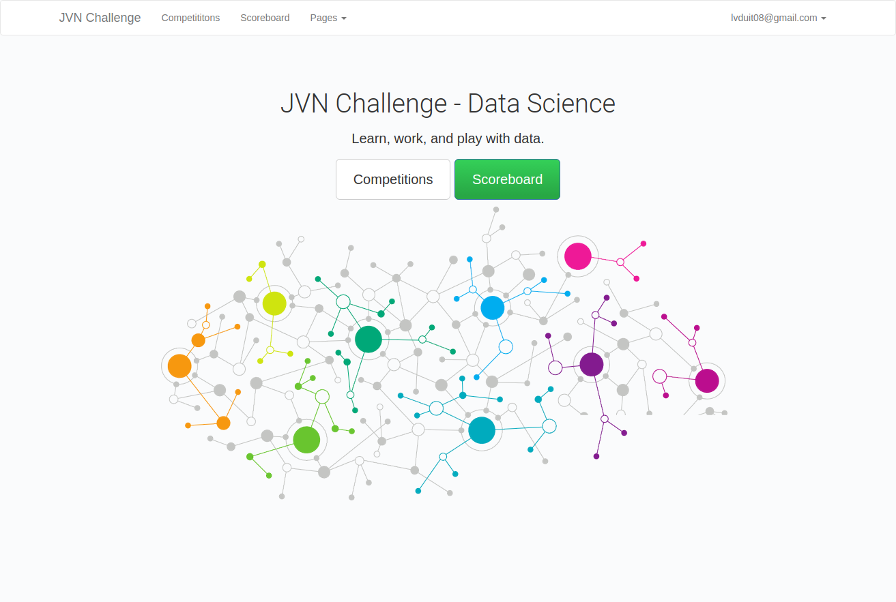

# jvn-challenge
JVN Challenge Score Board



# Installation 

Install packages
```
pipenv shell
pipenv install
```

Start django server:
```
python manage.py runserver
```

Go to: http://localhost:8000