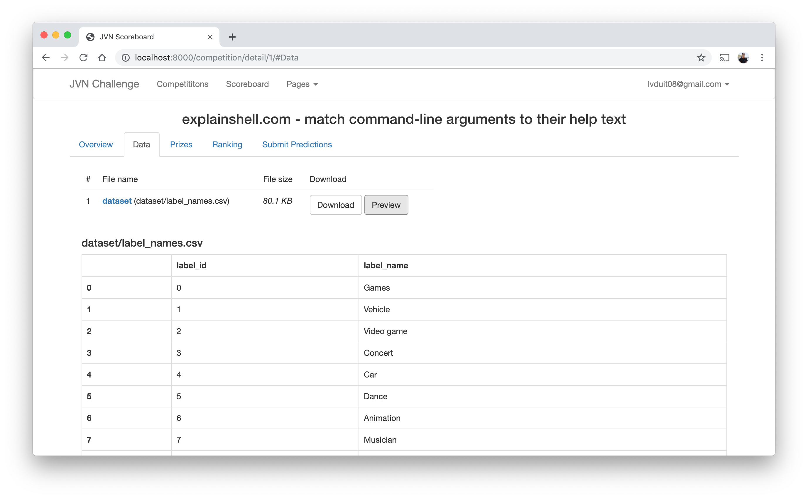
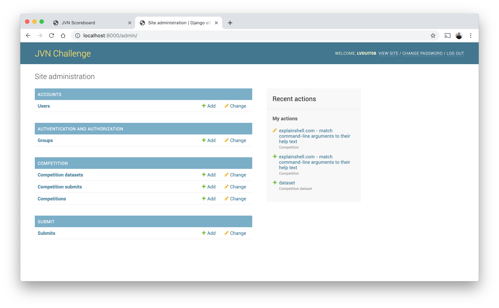

# jvn-challenge
JVN Challenge Score Board


# Installation 

Install packages
```
pipenv shell
pipenv install
```

Start django server:
```
python manage.py runserver
```

Go to: http://localhost:8000



Admin: http://localhost:8000/admin


